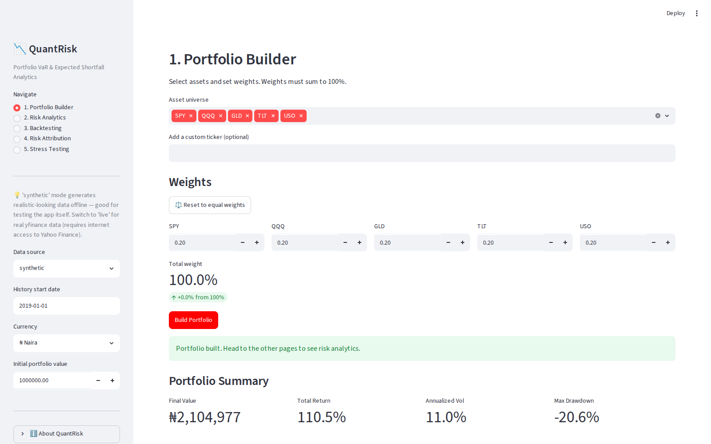
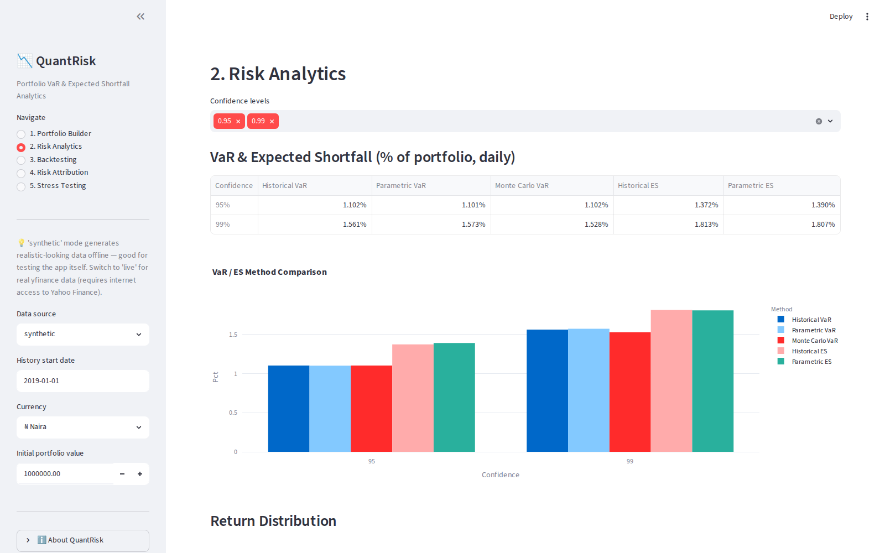
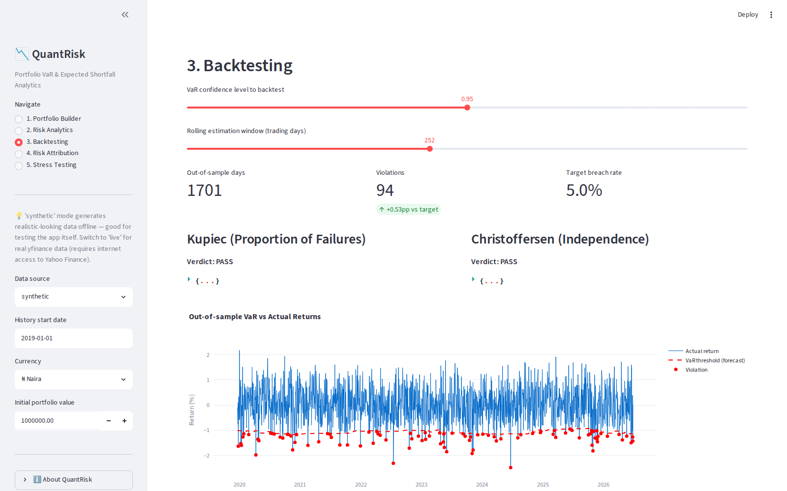
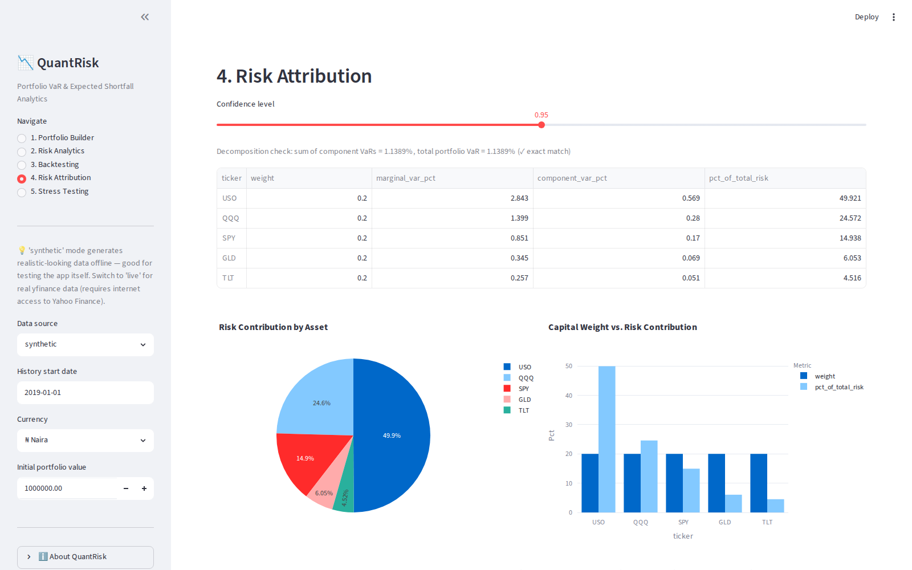
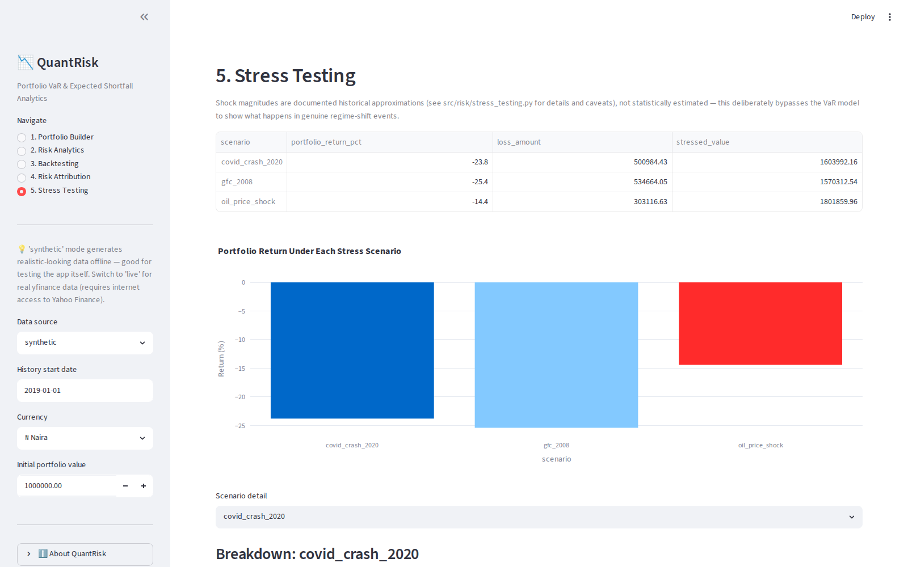

# QuantRisk: Portfolio VaR & Expected Shortfall Analytics Platform

An end-to-end portfolio risk engine built for quantitative risk analysis:
data pipeline → returns → Historical / Parametric / Monte Carlo VaR →
Expected Shortfall → risk attribution → out-of-sample backtesting
(Kupiec + Christoffersen) → historical-crisis stress testing → 5-page
interactive Streamlit dashboard.

Built by **Abdullahi Aliyu Ojonimi** ([GitHub](https://github.com/Abdullahi-Oj)) —
MSc Financial Engineering candidate, founder of QuantScore Analytics.

---

## Why This Project?

QuantRisk was developed to demonstrate a complete market risk
workflow — from market data ingestion through VaR estimation, model
validation, stress testing, and portfolio risk attribution. The project
emphasizes both quantitative correctness and software engineering best
practices, making it suitable as a research, educational, and
portfolio application.

## Key Features

- ✓ Historical VaR
- ✓ Parametric VaR
- ✓ Monte Carlo VaR
- ✓ Expected Shortfall (CVaR)
- ✓ Rolling Out-of-Sample Backtesting
- ✓ Kupiec Test
- ✓ Christoffersen Test
- ✓ Component VaR (Risk Attribution)
- ✓ Stress Testing (COVID 2020, GFC 2008, Oil Shock)
- ✓ Interactive Streamlit Dashboard
- ✓ Live & Synthetic Market Data

## Project Stats

| Metric | Value |
|---|---|
| Python modules | 10+ |
| Streamlit pages | 5 |
| Unit tests | 49 |
| Risk models | 5 (Historical, Parametric, Monte Carlo VaR; Historical & Parametric ES) |
| Backtesting methods | 2 (Kupiec, Christoffersen) |
| Stress scenarios | 3 (COVID 2020, GFC 2008, Oil Shock) |
| Portfolios validated against | 3 (Conservative, Balanced, Aggressive) |

## Methodology

**Portfolio return**

```
Rp = wᵀR
```
Weighted sum of individual asset returns, where `w` is the weight
vector and `R` is the asset return vector.

**Historical VaR**

```
VaRα = empirical α-quantile of historical portfolio returns
```
No distributional assumption — read directly off the historical return
distribution.

**Parametric VaR**

```
VaR = μ + zα·σ
```
Assumes normally distributed returns; `zα` is the standard normal
quantile at confidence level α (e.g. -1.645 at 95%, -2.326 at 99%).

**Monte Carlo VaR**

```
R_sim ~ MVN(μ, Σ),  n simulations
VaR = empirical α-quantile of simulated portfolio returns
```
Simulates joint asset return scenarios from the estimated mean vector
`μ` and covariance matrix `Σ`, then reads VaR off the simulated
distribution.

**Expected Shortfall (CVaR)**

```
ES = E[L | L > VaR]
```
The expected loss *given that* losses exceed the VaR threshold —
addresses VaR's blind spot to tail severity.

**Component VaR (Risk Attribution)**

```
MVaRᵢ = zα · (Σw)ᵢ / σp
CVaRᵢ = wᵢ · MVaRᵢ
Σᵢ CVaRᵢ = Portfolio VaR        (exact decomposition)
```
Marginal VaR is each asset's sensitivity to portfolio VaR; Component
VaR is its exact slice of total risk.

## Engineering Practices

Beyond the finance, this project is built with production-style
software engineering:

- **Modular architecture** — `data/`, `portfolio/`, `risk/`,
  `attribution/`, `backtesting/` are independent, composable packages
- **Object-oriented design** — every model is a class with a clean,
  testable interface (`MarketDataLoader`, `PortfolioManager`,
  `HistoricalVaR`, `RiskAttribution`, etc.)
- **Reusable components** — the same `PortfolioManager`/VaR classes
  work unchanged across any ticker universe or weight scheme
- **Automated testing** — 49 `pytest` tests across unit, validation,
  and UI-level layers, runnable with one command
- **Streamlit frontend** — a real interactive dashboard, not just
  notebooks
- **Reproducible synthetic datasets** — seeded random generation means
  every demo run and every test is exactly reproducible

---

## Screenshots

### Portfolio Builder
Pick any asset universe, set weights (auto-rebalances to equal weights
whenever you add/remove a ticker), and see the portfolio value path and
summary stats immediately.



### Risk Analytics
Historical, Parametric, and Monte Carlo VaR plus Historical/Parametric
Expected Shortfall, side by side, with the return distribution and VaR
threshold visualized.



### Backtesting
Genuine out-of-sample rolling VaR (not tested against its own training
data) scored with the Kupiec Proportion-of-Failures test and the
Christoffersen independence test.



### Risk Attribution
Exact decomposition of total portfolio VaR into per-asset components —
shows when an asset's *risk contribution* differs sharply from its
*capital weight* (here, USO is 20% of capital but ~50% of total risk).



### Stress Testing
COVID 2020, 2008 GFC, and an oil-price-shock scenario applied directly
to current portfolio weights, independent of the statistical VaR model.



---

## Quick start

```bash
pip install -r requirements.txt
streamlit run app/dashboard.py
```

Run `streamlit run` from this project root so the `src` package import
resolves correctly.

## Verifying the build is stable

```bash
pytest tests/ -v
```

**49 tests, all currently passing**, across three files:

- **`tests/test_engine.py`** (25 tests) — mathematical invariants and
  input-validation error messages: ES ≥ VaR, exact risk decomposition,
  weight validation, VaR monotonic in confidence, empty-data guards.
- **`tests/test_validation.py`** (23 tests) — explicit manual cross-checks
  for every core calculation, run across three portfolios spanning the
  risk spectrum (conservative / balanced / aggressive). See the table
  below for the actual evidence each test produces.
- **`tests/test_dashboard_smoke.py`** (4 tests) — drives the real
  Streamlit app via `AppTest`: clicks "Build Portfolio," navigates all 5
  pages, adds a custom ticker, asserts zero exceptions. This is the
  layer that catches UI-only bugs engine unit tests can't see.

Run `pytest tests/test_validation.py -v -s` to see the printed evidence
(not just pass/fail) for every check below.

### Validation evidence (synthetic data, balanced portfolio unless noted)

| Question | Result |
|---|---|
| Does Historical VaR match manual `np.percentile` calculation? | Exact match to 1e-9 at 90%/95%/99% |
| Does Parametric VaR behave correctly at 95%/99%? | Matches closed-form `μ + zσ` exactly; 99% VaR ≥ 95% VaR in all 3 test portfolios |
| Does Monte Carlo VaR converge as simulations increase? | Estimate variance across seeds: **0.000473** (n=500) → **0.000048** (n=20,000); distance to Parametric VaR: **0.000140** (n=200) → **0.000009** (n=50,000) |
| Does Expected Shortfall always exceed VaR? | Confirmed in all 3 portfolios × both confidence levels (6 checks), both Historical and Parametric methods |
| Does Kupiec correctly pass/fail? | PASS on a well-calibrated 5% sequence; FAIL on a 20% breach-rate sequence |
| Does Christoffersen detect clustering? | Two sequences with **identical** 50/1000 violation counts: independent → PASS, clustered into 5 crisis streaks → FAIL (LR=302, p≈0) |
| Do component VaRs sum exactly to total VaR? | Exact match (rel. tolerance 1e-9) across all 3 portfolios × 3 confidence levels (9 checks) |
| Are stress losses consistent with defined shocks? | Module output matches manual `Σ(weight × shock)` to the cent, across 3 portfolios × 3 scenarios (9 checks) |

A genuinely interesting result surfaced by the multi-portfolio testing:
the **conservative portfolio (60% bonds) actually *gained* money in the
COVID crash scenario** (its bond allocation's flight-to-safety rally
outweighed equity losses), while the balanced and aggressive portfolios
lost 21.4% and 32.9% respectively. That's the diversification-under-stress
story a single-portfolio test would never have surfaced.

## Data source note

`src/data/data_loader.py` supports three modes:

- `mode="live"` — pulls real adjusted close prices via `yfinance`.
  **Requires internet access to Yahoo Finance.**
- `mode="synthetic"` — generates correlated multi-asset price paths from
  a seeded multivariate-normal model. Used throughout this repo's own
  tests and the screenshots above.
- `mode="auto"` (default in `.load()`) — tries live, falls back to
  synthetic on any failure.

**Synthetic data caveat:** it's stationary and approximately Gaussian.
This means VaR methods agree more closely than they would on real data
(which has fat tails), and the Phase-10 backtest passes more easily than
it would against real volatility-clustering regimes. Re-run the
validation table above with `mode="live"` once you have real data, and
expect the numbers — especially at 99% confidence — to diverge more.

## Project structure

```
quantrisk/
├── app/
│   └── dashboard.py              # Streamlit dashboard, 5 pages
├── docs/
│   ├── screenshots/               # Real screenshots used in this README
│   └── capture_screenshots.py     # Playwright script that generated them
├── src/
│   ├── data/
│   │   ├── data_loader.py        # MarketDataLoader (live/synthetic)
│   │   └── returns_processor.py  # log returns, diagnostics, correlation
│   ├── portfolio/
│   │   └── portfolio.py          # PortfolioManager: weights -> returns/value
│   ├── risk/
│   │   ├── historical_var.py
│   │   ├── parametric_var.py
│   │   ├── monte_carlo_var.py
│   │   ├── expected_shortfall.py
│   │   └── stress_testing.py     # COVID / GFC / oil-shock scenarios
│   ├── attribution/
│   │   └── risk_attribution.py   # marginal/component VaR decomposition
│   └── backtesting/
│       ├── kupiec.py             # Proportion-of-Failures test
│       ├── christoffersen.py     # Independence test + Conditional Coverage
│       └── rolling_backtest.py   # out-of-sample rolling VaR driver
├── tests/
│   ├── test_engine.py            # invariants + error-message validation
│   ├── test_validation.py        # manual cross-checks, multi-portfolio
│   └── test_dashboard_smoke.py   # AppTest UI click-through
├── notebooks/                    # for your EDA / methodology writeup
└── requirements.txt
```

Every module under `src/` has a runnable `if __name__ == "__main__":` demo
at the bottom that exercises it against synthetic data.

## Implementation Reference

| Module | Method |
|---|---|
| `historical_var.py` | Empirical percentile of historical returns, no distributional assumption |
| `parametric_var.py` | Variance-covariance method, assumes normal returns |
| `monte_carlo_var.py` | 10,000-scenario simulation from estimated mean/covariance |
| `expected_shortfall.py` | Historical (tail mean) + Parametric (closed-form normal) CVaR |
| `risk_attribution.py` | Marginal/Component VaR — exact additive decomposition of portfolio VaR by asset |
| `kupiec.py`, `christoffersen.py`, `rolling_backtest.py` | Out-of-sample rolling VaR, tested for correct breach rate and independence/no-clustering |
| `stress_testing.py` | Deterministic historical-crisis shocks (COVID 2020, GFC 2008, oil shock) applied directly to current weights |

## Suggested next steps (deliberately deferred, not forgotten)

- **Real data validation**: re-run every phase with `mode="live"` and
  compare against the synthetic-data numbers in this README.
- **Fat-tailed Monte Carlo**: swap the multivariate normal in
  `MonteCarloVaR._simulate()` for a multivariate Student-t to capture
  tail risk that Parametric VaR misses.
- **Stress shock calibration**: replace the illustrative shock magnitudes
  in `stress_testing.py` with shocks computed directly from real
  peak-to-trough returns over windows you define.
- **Two-portfolio comparison** (global benchmark vs. NGX/Nigerian
  equities): the engine is already ticker-agnostic, so this is a config
  change (new `weights` dict + tickers), not new code.
